# Dark Knight Reads

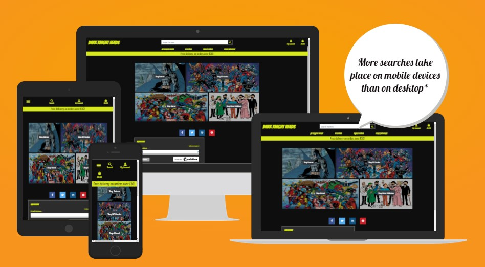

Dark Knight Reads is an online graphic novel store.

It is aim at the graphic novel fan regardless of the their publishing allegiance, as they have both DC and Marvel in the store.

As well as the big two publishers they also sell voels from the smaller publishers. These title have a cult following of their own and are enjoyed around the world.

The name Dark Knight Reads comes form a nickname given to Batman, The Dark Knight.

## Table of contents

- [UX](#UX)
    - [Business goals](#Business-goals)
    - [User goals](#User-goals)
    - [Layout Design](#Layout-design)
    - [Website pallette](#Website-pallette)
- [Features](#Features)
- [Technology](#Technology)
- [Testing](#Testing)
    - [Funcionality testing](#Functionality-testing)
    - [Compatability testing](#Compatability-testing)
    - [Code validation](#Code-validation)
    - [Issues found during testing](#Issues-found-during-testing)
    - [Performance testing](#Performance-testing)
- [Deployment](#Deployment)
- [Credits](#Credits)
- [Screenshots](#Screenshots)

## UX

### Business goals

The aim of the site is to allow users to browse the store with ease in order to pick out the titles they wish to buy.

The site allows users to filter the novels in the store by categories, including publisher, some of the main heros as well as by price. The users also have the ability to search the store by key words of their choosing.

Users are also able to create a userprofile which, should they choose, gives them the ability to pick an alter-ego which customises their user experiece (a little bit).

The sites superusers have some CRUD functionality in order to maintain the store, they have the ability to add / edit and remove ites from the store.

### Business marketing stratergy

The business has tried to make use of good SEO practises, by using words associated with its business type throughout the site as well as adding keywords to the meta sections.

The business is also using the email marketing tools from MailChimp that will maintain a communication link between the business and the existing customers in order to generate repeat traffic.

The business also has a Facebook business page in order to spread exposure of the site to users of that platform.

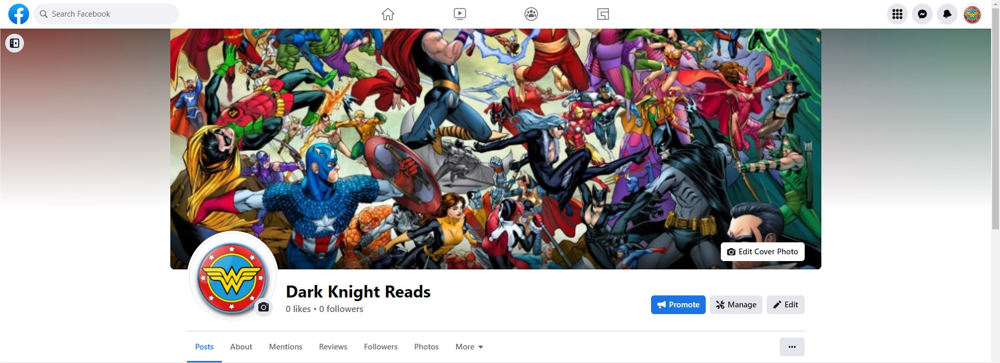

The business aims to build a following on that platform with regular posts about products and future events.

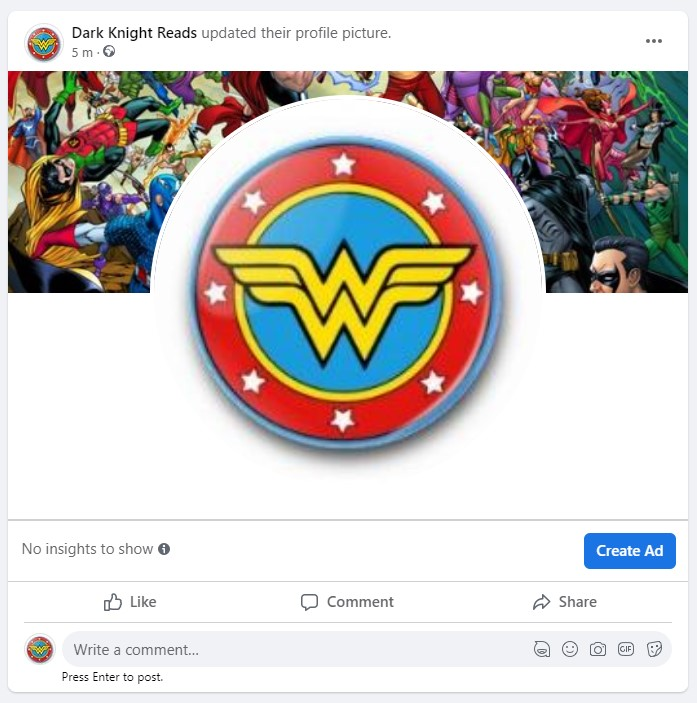

### User goals

User can either enter the store with a title in mind or just to browse and see whats available, either way they will find many titles that appeal to them.

### Layout Design

As part of the design process, I simply planned the layout using a whiteboard and a pen - I did alot of the planning with my 3 year old son, who helped a lot.

- Initial home layout

Initially I wanted the heros to be standing side by side when the user enters the site, however due to a lack of good image material this had to be scrapped.

- Final home layout

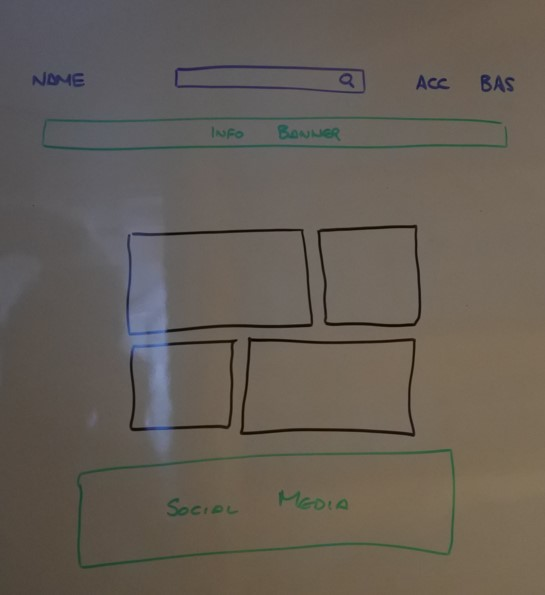

The final design has a box grid layout where the boxes are overlapped in the center, giving some a bigger space than others but all siting within a single box container in the middle of the page.

- Weird home layout

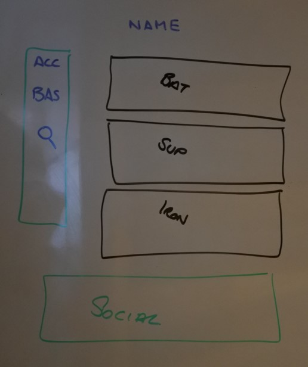

I looked at moving the navbar items to a fixed position to the left of the page content, however I scrapped this as it may have ended up confussing the users as the search bar would have to shoot out into the page content.

- Product detail layout

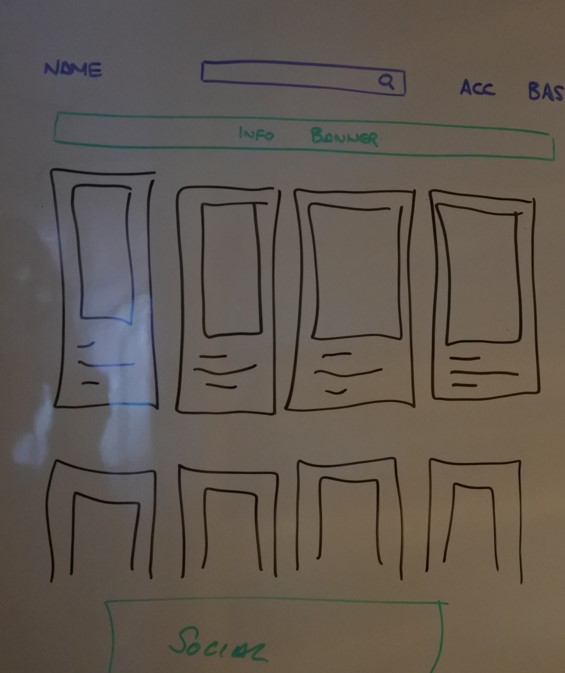

I really liked the product detail layout for Boutique Ado and so simply modified this to suit my needed.

### Website pallette

The pallet was driven by Batmans costume colors. Therefore the site has a dark and edgy feel, while also including a touch of fun - with the font choice.

- Background color: #000 Which is black
- Font color: #d7e81e Which is a slightly darker yellow than the standard yellow.
- Font choice: Bangers for the titles, Oswald for the body text

## Features

The site has 6 main pages that users will navigate through. These pages are;

- Landing page

- Product list page

- Product detail page

- Basket page

- Checkout page

- User profile page

As well as the normal login, logout, signin pages.

### Existing Features

- Navigation Bar

    - Navigation bar is presented in the same format on all pages to avoid any confusion when navigating the site.
    
    - Featured on all pages within the site to allow navigation from any page to any other page as the site title, search and navbar sections stay visible on each page.

- Social media links

    - These, like the navbar, are present on all pages and link to the sites social media pages. The links open in a new tab.

- Mailchimp newsletter sign up

    - There is a section at the  bottom of each page that allows users to sign up for  a newsletter subscription via MailChimps embeded sign up panel.

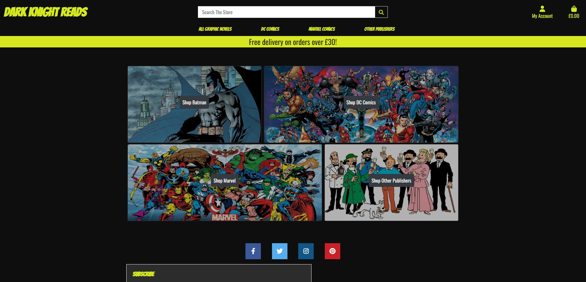

- The landing page image banner

    - This landing page banner provides the user with a snap shot of the four main categories of novels within the site.

    - The navbar buttons expand when clicked and give the user the option to pick a category of novel in order to refine the list of novels.

    - The buttons within the images takes the user to that category of novels.

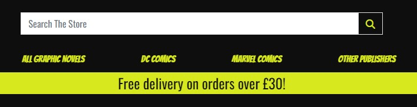

The above image shows the banner text that can be clicked.

- The landing page also has a search bar for the users to search for novels based on their own keywords search

- Below the image links there is the social media section with clickable links to external sites (Facebook, Twitter, Instagram and Pinterest)

- There is also an embeded MailChimp signup box for user to subsrcibe to the newsletter.

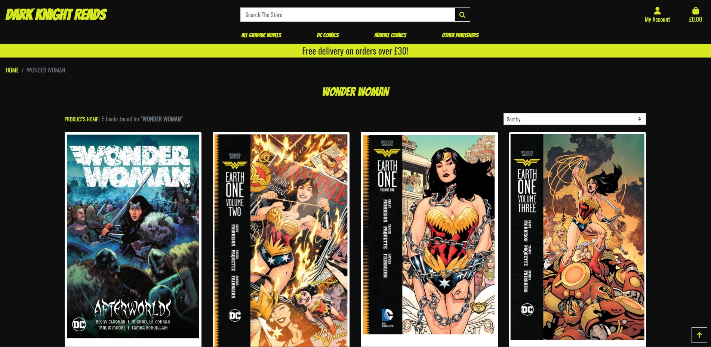

- Products List Page

    - This is a grid layout that allows users to scroll through the available books wihtinthe store.

    - Each novel has some detail attached for the user to read, this includes, title, publisher, author, illustrator, price.

    - If the user is a superuser they also have an edit / delete button in order to user their CRUD functionality.

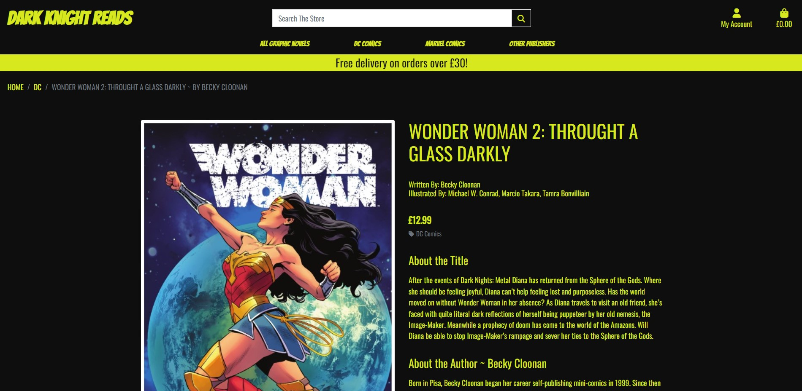

- Product detail page

    - This has information about the selected title in more detail.

    - This detail includes title, author, illustrated by, price, publisher, about the title, about the author.

    - The key shopping experience section has a qty box for the user to select the qty of the product they wish to buy, a keep shopping button that tkaes them back to the product list page and an 'add to bag' button.

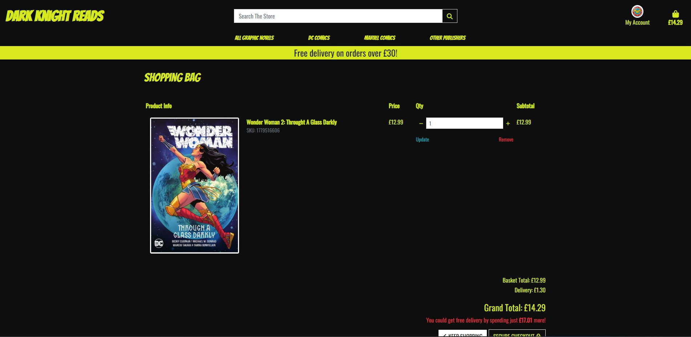

- The basket page

    - This shows the user the products currently in their basket.

    - The structure of this page is a grid, with a smaller image of the title as well as the title, SKU, price, Qty and subtotal sections.

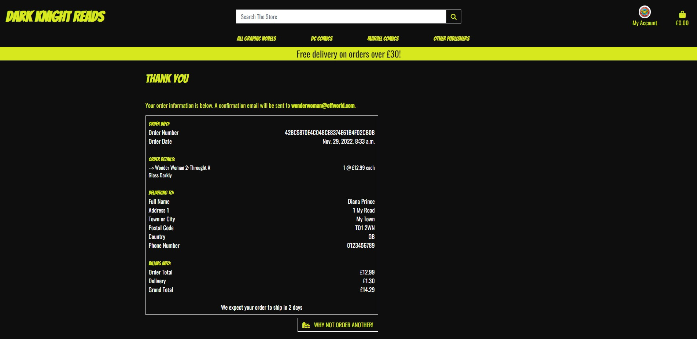

- Order confirmation page

    - This gives the user a snapshot of the key details about their completed order.

    - This is broken into sections within a box. The sections are Order Info, Order Details, Delivering To and Billing Info

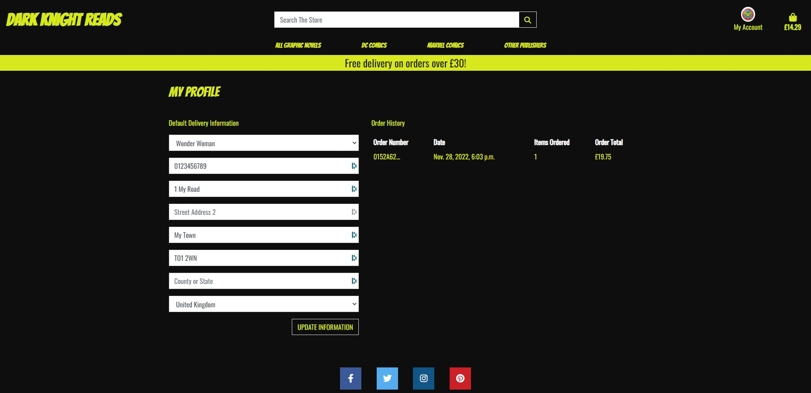

- User profile page

    - Users can add thir key details (not payment information) in their user profile. This saves them time at the checkout later on as it is preloaded within the checkout form.

    - They can also pick their alter-ego which modified their account badge at the top of the page.

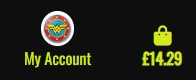

- Account signup / signout

    - Via the Allauth library, user have the ability to sigup, login and logout of their accounts.

    - There is also a 'forgot my password' form for the user to compelte in the event of them forgetting their password. This helps to keep their account safe.

- Users feedback

    - Throughout the site there are toasts that pop-up and give the user feedback on the actiosn they have carried out on the site. For exmaple when they add a product to their basket.

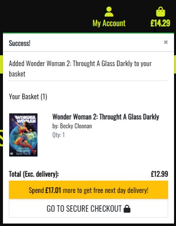

## Technology

### Security

- The security aspects of the site are handled by the built in csrf token use for securing POST request.
- Stripe covers the payment security aspects.
- Aspects of the site that are reserved for superusers are protected by the RequireLogin decorator in the code, so that only superusers can access them.

### Python / Django

- The programming language and framework.
### HTML

- The structure language of the site.

### Bootstrap / CSS

- The styling language and framework.

### Font Awesome

- The library for the icons used within the site

### AWS Storage

- The image storage for the site.

### Allauth

- User authentication, verification and account management.

### Crispy Forms

- Used for form context, styling and rendering.

### Gunicorn

- Web server for Python.

### Stripe

- Payment processing software, this enables secure payments from the store.

## Testing

### Functionality testing

- The site was developed using the Chrome developer tools for the HTML and styling elements.

- The Python testing was carried out using coverage.

# INSERT IMAGE OF COVERAGE REPORT HERE

#### Model Testing

    -""" Imports TestCase from django.test"""
    from django.test import TestCase
    from django.contrib.auth.models import User
    from .models import Post, Comment

    class TestBlogModels(TestCase):
        """ Inherits TestCase for all functions below
        """

        def test_post_str(self):
            """ Tests a post can be created and title is returned.
            """
            user = User.objects.create(username="Name",)
            post = Post.objects.create(title="Test Title", author=user)
            self.assertEqual(post.title, "Test Title")

        def test_comment_str_(self):
            """ Tests a comment can be created and that the body and
                author can be returned.
            """
            user = User.objects.create(username="Name",)
            post = Post.objects.create(title="Test Title", author=user)
            comment = Comment.objects.\
                create(post=post, body="Some text", name="Me", approved=True)
            self.assertEqual(comment.body, "Some text")
            self.assertEqual(comment.name, "Me")

The above tests were used to test the models were setup to handle the required data in order to manage to trail posts.

### Views Testing

    -   """ Imports TestCase from django.test """
        from django.test import TestCase
        from django.contrib.auth.models import User
        from .models import Post, Comment

        class TestViews(TestCase):
        """ Inherits TestCase for all functions below
        """

        def test_post_list_opens_trail_list(self):
            """ Test the corrrect template is used
            """
            response = self.client.get('/trails/')
            self.assertEqual(response.status_code, 200)
            self.assertTemplateUsed(response, 'trails.html')

        def test_post_detail_operates_as_expected(self):
            """ Tests the post detail creates a post as expected
            """
            user = User.objects.create(username="Name")
            post = Post.objects.\
                create(title="Test Title", author=user, status=1)
            comment = Comment.objects.\
                create(post=post, body="Some text", name="Me", approved=True)
            self.assertEqual(comment.body, "Some text")
            self.assertEqual(post.status, 1)

        def test_open_home_page_works(self):
            """ Test the corrrect template is used
            """
            response = self.client.get('/')
            self.assertEqual(response.status_code, 200)
            self.assertTemplateUsed(response, 'index.html')

        def test_open_cafe_page_works(self):
            """ Test the corrrect template is used
            """
            response = self.client.get('/cafe/')
            self.assertEqual(response.status_code, 200)
            self.assertTemplateUsed(response, 'cafe.html')

        def test_open_gallery_page_works(self):
            """ Test the corrrect template is used
            """
            response = self.client.get('/gallery/')
            self.assertEqual(response.status_code, 200)
            self.assertTemplateUsed(response, 'gallery.html')

While I am happy with the tests carried out on the views it is still short of where I wanted to be (50%). I struggled to carry out these tests as thourghly as I would have liked.

#### Forms Testing

    -   """ Imports Testcase from django.test"""
        from django.test import TestCase
        from .forms import CommentForm

        class TestCommentForm(TestCase):
            """ Inherits TestCase for all functions below
            """
            def test_coment_body_is_required(self):
                """ Tests name is a required field in form
                """
                form = CommentForm({'body': ''})
                self.assertFalse(form.is_valid())
                self.assertIn('body', form.errors.keys())
                self.assertEqual(form.errors['body'][0], 'This field is required.')

            def test_years_riding_default_is_working(self):
                """ Tests years riding default value is valid
                """
                form = CommentForm({'body': 'my comment', 'years_riding': 0})
                self.assertTrue(form.is_valid())

            def test_form_fields_are_explicit_in_form_metaclass(self):
                """ Tests form fields are in place and in order
                """
                form = CommentForm()
                self.assertTrue(form.Meta.fields, ['body', 'years_riding'])

The forms were 100% tested, although the form is small and required very little testing.
### Compatability testing

- The site has been tested on multiple screen sizes and is responsive throughout.

### Code validation

- The HTML and CSS have been tested using jigsaw.w3.org with no errors showing.

- The Python was also tested online with no errors showing.

### Issues found during testing

- When testing the models, views and forms with TestView I had an issue in getting the tests to run. This was because I had already deplyed the site to Heroku and so had the database pointed to Postgres and not SQLite3.

- Once the database was reset to SQLite the test ran ok.

- I would have liked to do more tests but time has caught up with me and I can't risk missing this deadline, so the testing was focused as much as possible. The items that haven't been covered in the coverage report have been manually tested in deployment.

### Performance testing

- Site has been evaluated by Lighthouse and the report is below.

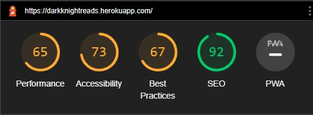

- I didn't have time to investigate and rsolve the images in order to improve this score.

## Deployment

The site is deployed from Heroku.

1. Click deploy from app home page

2. Click GitHub link in deployment method and link the repository

3. Click deploy branch button

4. Click open app button

# Future developments

- It would be benefical for the site to have a special offers page in order to encourage new users to try a product at a smaller price with the aim of getting them to return in the future.

- Also it would be beneficial to have similiar products on the products detail page, this may encourage users who change their mind on a given product to look into something similiar.

- The themeing of the site could also be linked to the users alter-ego, for example if they like superman, then maybe the site could change fom black and yellow to blue, red and yellow. This would be based on users feedback.

# Credits

- The site is heavily influenced by the Boutique-Ado project.

- The Code Institute Blog and ToDo app walkthoughs were the basis for the inner workings of the site, such as Django and Python functions.

- StackOverflow proved a valuable resource for solving some of the bugs

- All of the images came from from Google searches and I don't own any of the images.

- The other students on Slack helped me with the testing issues, clearly some had faced the same issue, such as the backport issues.

- The tutors at CodeInstitute helped to reolve some version issues I had with Alluth, Django and Heroku.

## Screenshots

### Landing Page

### Product List Page

### Product Detail Page

### Checkout Page
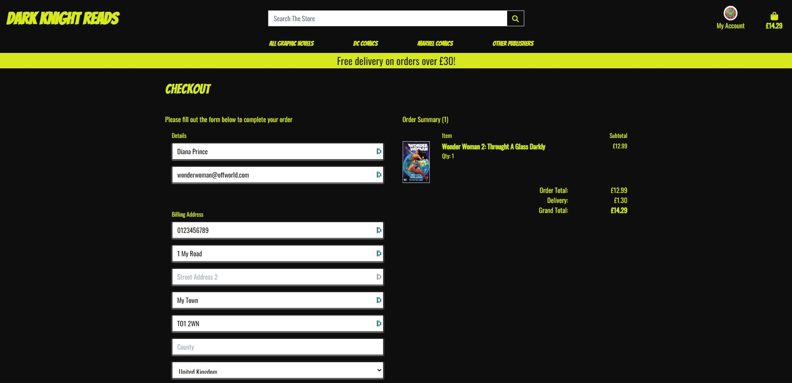

### Order Confirmation Page

### User Profile Page Page

